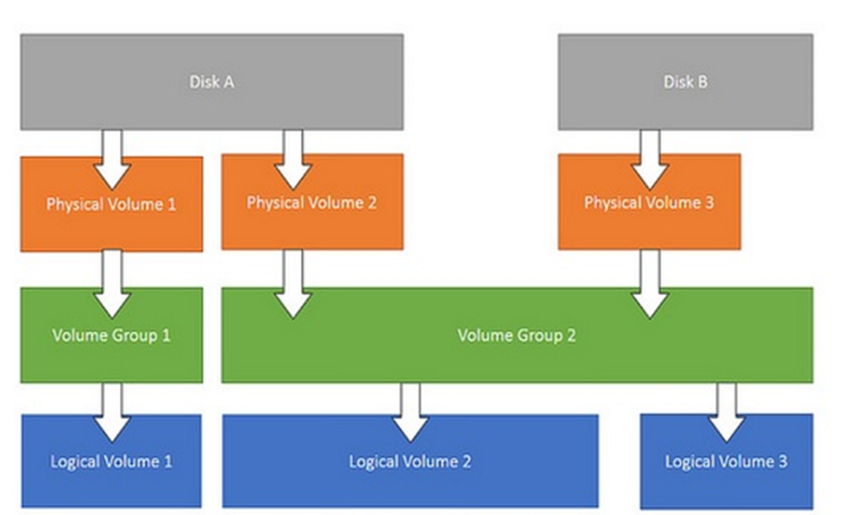

# Linux Operating System

## UNIX
**UNIX** is a multiuser, multitasking operating system developed in 1969 at AT&T Bell Labs by Ken Thompson and Dennis Ritchie.  
It is mainly used in enterprise and server environments.

---

## Linux
**Linux** is an open-source, Unix-like operating system kernel created in 1991 by Linus Torvalds.  
It is widely used in servers, cloud computing, desktops, and embedded systems.

---

## Difference Between UNIX and Linux

| Feature | UNIX | Linux |
|----------|------|------|
| Developed | 1969 | 1991 |
| Developer | AT&T Bell Labs | Linus Torvalds |
| Source Code | Proprietary | Open Source |
| Cost | Paid | Free |
| Flexibility | Limited | Highly Customizable |
| Usage | Enterprise Systems | Servers, Cloud, DevOps, Desktop |
| Examples | AIX, Solaris, HP-UX | Ubuntu, Debian, CentOS |

---
<br><br>
# Linux Kernel

## Definition
The **Linux Kernel** is the **core component of the Linux operating system** with complete control over everything in the system, and acts as a interface between **hardware** and **software applications**.

It directly communicates with system hardware and manages system resources.

---

## Main Responsibilities of Linux Kernel
- Process Management
- Memory Management
- Device Management
- File System Management
- System Security
- Hardware Communication
---

<br><br>

## Linux Distributions
A Linux distribution is a member of the family of Unix-like software distributions built on top of the Linux kernel. There are currently over three hundred Linux distributions.

## Examples of Linux Distributions
- Ubuntu
- Debian
- Red Hat Enterprise Linux (RHEL)
- CentOS
- Fedora
- Kali Linux

<br><br>


## UNIX/Linux File System Characteristics
- Supports multiple file system types:
  - ext2
  - ext3
  - ext4
  - ReiserFS
  - XFS
- Uses a **single hierarchy (tree structure)**.
- Everything starts from one **root directory (`/`)**.
- All files and directories exist under the root.
- File extensions are **optional**.
- System does **not depend on filename extensions** to determine file type.

---

## Windows File System Characteristics
- Supports limited file systems:
  - NTFS
  - FAT16
  - FAT32
- Uses **drive letter abstraction**:
```
A:, B:, C:, D: ... Z:
```
- Files are stored on separate disk partitions.
- System behavior depends on **file extensions**:
- `.exe` → Executable
- `.txt` → Text file
- `.jpg` → Image file

---

<br><br>

# Inodes

## Definition
An **inode (Index Node)** is a data structure in UNIX/Linux file systems that stores metadata about a file or directory such as permissions, owner, size, and timestamps, but not the file name or actual data.

## Information Stored in an Inode
- File size
- Owner ID
- Group ID
- File permissions
- Last access time
- Last modification time
- Disk block locations

✅ **Important:**  
Inode **does not store the filename**.

---

## Directory and Inodes
- Directories map **filenames → inode numbers**.
- Each directory contains:
    - Entry for itself (`.`)
    - Entry for parent (`..`)
    - Entries for child files/directories

---
<br>

# Link
A **Link** in Linux is a mechanism that allows multiple filenames to refer to the **same file** or to create a **reference (shortcut)** to another file or directory.

---

### 1. Hard Link
A **Hard Link** is a direct pointer to the **inode** of a file.
- Points directly to the same inode as the original file.
- Since inodes are unique within a file system, **hard links cannot cross file systems**.
- Indistinguishable from the original file.
- Any changes made in one file are reflected in all linked files.
- A file remains accessible as long as at least one hard link exists.
- Deleting the original file does **not** remove the data if hard links still exist.

### Command
```bash
ln original_file hardlink_name
```

---

### 2. Soft Link (Symbolic Link)

A soft link is a pointer to the filename/path of another file.
- Works across file systems
- Acts like a shortcut
- Breaks if original file is deleted or moved
- Can link directories
- Create Soft Link

### Command
```bash
    ln -s original_file symlink_name
```
<br><br>


# Logical Volume Manager (LVM) in Linux

**LVM (Logical Volume Manager)** is a storage management system in Linux that allows flexible management of disk storage compared to traditional partitioning.

It enables:
- Dynamic resizing of storage
- Combining multiple disks
- Snapshot creation
- Easy disk management

---

### Why LVM is Needed?

Traditional Partition Problem:
- Fixed partition size
- Difficult to resize
- Cannot combine disks easily

✅ LVM Solution:
- Resize partitions anytime
- Add/remove disks dynamically
- Better storage utilization

---
<br>

# LVM Architecture


- Initialize the partitions you will use for the LVM volume as physical volumes (this labels them)
- Create a volume group
- Create a logical volume
- After creating the logical volume you can create and mount the file system.

---

## 1. Physical Volume (PV)
A **Physical Volume (PV)** is a **physical storage device** or partition that has been initialized for use by the **Logical Volume Manager (LVM)**.
It is the **first layer** in LVM storage management.

Examples:
- Hard disk
- SSD
- Disk partition

Example devices:
- /dev/sdb
- /dev/sdc1


**Create the Physical Volume:**
```bash
    pvcreate /dev/sdb
```
**View Physical Volumes:**
```bash
    pvs
    pvdisplay
```
<br>

## 2. Volume Group (VG)
- A **Volume Group (VG)** is a collection (pool) of one or more **Physical Volumes (PV)** combined together to form a single storage pool in LVM.

- It acts as an intermediate layer between **Physical Volumes** and **Logical Volumes**.

### Example
Suppose:
- `/dev/sdb` = 100GB
- `/dev/sdc` = 100GB

After creating VG:
- `VG Size = 200GB Storage Pool`
Now logical volumes can be created from this pool.


### Creating a Volume Group
```bash
vgcreate data_vg /dev/sdb
```

### View Volume Groups
```bash
vgs
vgdisplay
```

### Extend Volume Group (Add New Disk) 
```bash
# Add another Physical Volume:
    vgextend data_vg /dev/sdd
# Storage increases without downtime ✅
```


### Reduce Volume Group
```bash
# Remove a PV:
vgreduce data_vg /dev/sdd
```

<br>

## 3. Logical Volume (LV)

- A **Logical Volume (LV)** is a virtual partition created from the available space of a **Volume Group (VG)**.

- It acts like a normal disk partition where users can create filesystems and store data.

- Logical Volumes are flexible and can be resized dynamically without affecting running systems.

---

### Example:
Suppose:
- `Volume Group (data_vg)` = **200GB**

You can create:
- `lv_app` = 50GB  
- `lv_backup` = 100GB  
- Remaining space stays free in VG

Logical volumes are created from this storage pool.

---

### Creating a Logical Volume
```bash
lvcreate -L 5G -n my_lv data_vg
````

---

### View Logical Volumes

```bash
lvs
lvdisplay
```

Logical volume device path:

```
/dev/data_vg/my_lv
```

---

### Create Filesystem on Logical Volume

```bash
mkfs.ext4 /dev/data_vg/my_lv
```

---

### Mount Logical Volume

```bash
mkdir /data
mount /dev/data_vg/my_lv /data
```

---

### Extend Logical Volume (Increase Size)

```bash
lvextend -L +5G /dev/data_vg/my_lv
resize2fs /dev/data_vg/my_lv
```

---

### Reduce Logical Volume (Careful Operation)

```bash
umount /data
e2fsck -f /dev/data_vg/my_lv
resize2fs /dev/data_vg/my_lv 3G
lvreduce -L 3G /dev/data_vg/my_lv
mount /data
```

<br><br>

# Swap in Linux

## What is Swap Space?

**Swap space** is a reserved area on disk used when the system's **physical memory (RAM)** becomes full.
- Inactive memory pages are moved from **RAM → Swap Space**
- This frees RAM for active processes.

✅ Swap helps prevent system crashes due to memory shortage.

---

### `Important Point `

Swap is **not a replacement for RAM** because:
- Disk access is much slower than RAM.
- Excessive swap usage reduces performance.

---

### Types of Swap Space

Linux supports:

1. **Swap Partition** ✅ (Recommended)
2. **Swap File**
3. Combination of both

---
<br>

## 1. Swap Partition

A **Swap Partition** is a dedicated disk partition reserved only for swap usage.

### Characteristics
- Created during disk partitioning.
- Separate from normal filesystem.
- Usually faster on HDDs.
- Stored in contiguous disk blocks.

### Advantages
- Better performance on rotational HDDs.
- No filesystem overhead.
- Stable and reliable.

### Disadvantages
- Size cannot be easily changed.
- Requires repartitioning or LVM tools.
- May cause downtime during resizing.

---
<br>


## 2. Swap File
A **Swap File** is a regular file created inside an existing filesystem and used as swap.

Example: ` /swapfile `

### Characteristics
- Flexible and easy to manage.
- Can be created or removed anytime.
- Size can be increased or decreased easily.

### Advantages
- No repartitioning required.
- Can exist on any mounted filesystem.
- Easy administration.

### Disadvantages
- Must be **contiguously allocated**.
- Slight overhead compared to partition (historically).


## `Performance Note (Linux Kernel ≥ 2.6)`

Modern Linux kernels:
- Maintain a mapping of swap file blocks.
- Access swap directly on disk.
- Bypass filesystem cache and overhead.

👉 Result:  
**Swap files perform almost the same as swap partitions**.

---

## Flexibility Comparison

| Feature | Swap Partition | Swap File |
|----------|---------------|-----------|
| Performance | Slightly Better | Nearly Equal |
| Resize | Difficult | Easy |
| Creation | During partitioning | Anytime |
| Flexibility | Low | High |
| Downtime Risk | Possible | None |
| Location | Dedicated partition | Any filesystem |
---

## When to Use What?

✅ Use **Swap Partition**:
- Production servers
- HDD-based systems
- Stable long-term setups

✅ Use **Swap File**:
- Cloud systems
- Virtual machines
- Dynamic environments
- DevOps workloads

---
<br><br>

# Swappiness

### What is Swappiness?

**Swappiness** is a Linux kernel parameter that controls **how aggressively the system uses swap space** when RAM starts getting full.

It decides whether Linux should:
- Move data from **RAM → Swap**, or
- Free memory by removing cached data (**Page Cache**).
---

### Memory Handling in Linux

When memory is required and free RAM is low, Linux has two options:

1. **Drop Page Cache**
   - Remove cached files/program data.
   - Can be reloaded quickly from disk.

2. **Swap Memory Pages**
   - Move inactive ("cold") processes from RAM to swap space.
   - Frees RAM but slower to restore later.

👉 **Swappiness controls this decision.**


## Swappiness Value Range: 
`0 → 100`

| Value | Behavior |
|-------|----------|
| 0 | Avoid swapping as much as possible |
| 1–30 | Prefer RAM, minimal swap usage |
| 60 | Default Linux value |
| 70–100 | Aggressive swapping |

` Default Value: Swappiness = 60`

## Practical Example
```
System RAM = 8GB
If Swappiness = 10:
RAM preferred → Swap rarely used

If Swappiness = 80:
Inactive apps moved to Swap early
More cache kept in RAM
```


---

**Check Current Swappiness**
```bash
cat /proc/sys/vm/swappiness
```

**Temporarily Change Swappiness**
```bash
sudo sysctl vm.swappiness=20
```

**Permanent Change**
```
Edit:

sudo vim /etc/sysctl.conf
```

**Add:**
```
vm.swappiness=20
```

**Apply:**
```
sudo sysctl -p
```


<br><br>

# Swap Space in Linux (Practical)


## Check Existing Swap Space

```bash
cat /proc/swaps
free -h
```
Shows:

- Active swap devices
- Total swap usage

---
<br>

## Adding Swap as an LVM Logical Volume

### Step 1: Create Logical Volume (2GB)

```bash
lvcreate VolGroup00 -n LogVol02 -L 2G
```

| Option        | Description         |
| ------------- | ------------------- |
| `VolGroup00`  | Volume Group        |
| `-n LogVol02` | Logical Volume name |
| `-L 2G`       | Size of swap        |


## Step 2: Format as Swap

```bash
mkswap /dev/VolGroup00/LogVol02
```

Converts LV into swap space.


## Step 3: Add Entry in `/etc/fstab`

```bash
/dev/VolGroup00/LogVol02 swap swap defaults 0 0
```

Ensures swap activates automatically at boot.


## Step 4: Reload System Configuration

```bash
systemctl daemon-reload
```


## Step 5: Activate Swap

```bash
swapon -v /dev/VolGroup00/LogVol02
```

---

## Verify Swap

```bash
cat /proc/swaps
free -h
```

✅ Swap LV is now active.

---
<br><br>

# Creating a Swap File

## Step 1: Decide Swap Size

Example:
```
64 MB Swap
64 × 1024 = 65536 blocks
```

## Step 2: Create Empty Swap File

```bash
dd if=/dev/zero of=/swapfile bs=1024 count=65536
```
Creates swap file filled with zeros.


## Step 3: Format Swap File

```bash
mkswap /swapfile
```


## Step 4: Secure Swap File

```bash
chmod 0600 /swapfile
```

Prevents other users from accessing memory data.


## Step 5: Add to `/etc/fstab`

```bash
/swapfile swap swap defaults 0 0
```


## Step 6: Reload Configuration

```bash
systemctl daemon-reload
```


## Step 7: Activate Swap Immediately

```bash
swapon /swapfile
```


## Verify Swap Activation

```bash
cat /proc/swaps
free -h
```

---

# Removing a Swap File

## Step 1: Disable Swap

```bash
swapoff -v /swapfile
```

## Step 2: Remove Entry from `/etc/fstab`

```bash
vi /etc/fstab
```

Delete:

```
/swapfile swap swap defaults 0 0
```


## Step 3: Reload Configuration

```bash
systemctl daemon-reload
```


## Step 4: Delete Swap File

```bash
rm /swapfile
```
---
<br><br>


# Disk Quotas in Linux

**Disk Quotas** are used to limit and control how much disk space users or groups can use on a system.

They help prevent:
- Users from consuming excessive disk space
- Disk partitions from becoming full

---

### Types of Disk Quotas
- **User Quota** → Limits disk usage for individual users.
- **Group Quota** → Limits disk usage for user groups or projects.

---

### What Can Be Controlled?

**1. Disk Blocks**
- Controls the **amount of storage space** used (MB/GB).

**2. Inodes**
- Controls the **number of files** a user can create.

---
<br><br>


# Boot Process & Boot Loaders in Linux

When a computer is powered **ON**, the operating system is not yet loaded into RAM.


## Boot Process

1. The system starts a small program stored in **ROM**.
2. This program locates the operating system stored in **non-volatile storage** (Hard Disk/SSD).
3. It loads the OS into **RAM**.
4. The operating system starts running.

The small program responsible for starting this process is called the **Boot Loader (Bootstrap Loader)**.


## Boot Loader
A **Boot Loader** loads the operating system kernel into memory and starts it.

Sometimes multiple boot loaders are used in stages (**chain loading**).


## Types of Linux Boot Loaders

### 1. LILO (Linux Loader)
- Older Linux boot loader.
- Limited features.
- Initially had no graphical menu.
- Less flexible.

---

### 2. GRUB (Grand Unified Bootloader)
- Modern and widely used boot loader.
- Easier administration.
- Supports command-line interface.
- Network boot support.
- Password protection (MD5).
- Supports multiple operating systems.

---

### GRUB Configuration Files
```bash
/boot/grub/grub.conf
/etc/grub.conf
```
---
<br><br>

# Runlevel in Linux

A **Runlevel** defines the operating state of a Linux system after boot, meaning which services and environment are started.

### Common Runlevels

| Runlevel | Description |
|-----------|-------------|
| 0 | Shutdown system |
| 1 | Single-user / Maintenance mode |
| 3 | Multi-user mode (CLI) |
| 5 | Graphical User Interface (GUI) |
| 6 | Reboot system |


## Systemd Targets (Modern Linux)

Modern Linux distributions use **systemd targets** instead of runlevels.

| Runlevel | Systemd Target |
|-----------|----------------|
| 0 | poweroff.target |
| 1 | rescue.target |
| 3 | multi-user.target |
| 5 | graphical.target |
| 6 | reboot.target |

---


### Check Default Runlevel
```bash
systemctl get-default
```

### Set Default Runlevel
```bash
systemctl set-default multi-user.target
```
---

### `Purpose of Runlevels and Systemd Targets in Linux`

- The main purpose of runlevels (old system) and targets (systemd) is to control how the Linux system starts and what services should run after boot.
---
