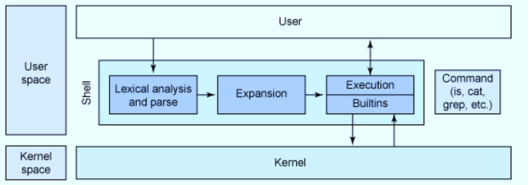

# Shell
A shell is a program that provides an interface between a user and an operating system (OS) kernel. It translate or interprets the user command and pass to the linux kernel for execution.

## Shell architectue


 The basic architecture is pretty similar to a pipeline, where input is analyzed and parsed, symbols are expanded. It uses a variety of methods such as brace, tilde, variable and parameter expansion and substitution, and filename generation. Then, commands are executed using shell built-in commands, or external commands.

 ## Types of Shell in Linux

- **Bourne Shell (sh)**  
  The original UNIX shell developed by Stephen Bourne, used for basic scripting and system administration tasks.

- **Bourne Again Shell (bash)**  
  An enhanced version of Bourne Shell with advanced features like command history, auto-completion, and scripting support; default shell in most Linux systems.

- **Korn Shell (ksh)**  
  A powerful shell combining features of Bourne Shell and C Shell, widely used for advanced scripting in UNIX environments.

- **C Shell (csh)**  
  A shell designed with C-like syntax, mainly used for interactive use and scripting with improved command history features.

- **Z Shell (zsh)**  
  An advanced and highly customizable shell with powerful auto-completion, plugins, and improved user experience over bash.

---

## Difference Between Types of Shell

| Shell | Full Name | Developed By | Features | Default Usage |
|------|-----------|-------------|----------|---------------|
| **sh** | Bourne Shell | Stephen Bourne | Basic scripting, simple commands | Old UNIX systems |
| **bash** | Bourne Again Shell | GNU Project | Command history, auto-completion, scripting | Default in most Linux systems |
| **ksh** | Korn Shell | David Korn | Advanced scripting, better performance than sh | Enterprise UNIX |
| **csh** | C Shell | Bill Joy | C-like syntax, aliases | BSD UNIX |
| **zsh** | Z Shell | Paul Falstad | Powerful customization, plugins, themes | Developers & power users |
---
<br>

## Bash Shell Startup Files 

#### What are Bash Startup Files?
Startup files are scripts executed automatically when **Bash shell starts** to configure the environment (aliases, variables, PATH, prompt, etc.).

---

### 🟢 1. Interactive Login Shell
**Meaning:**
User logs into the system after authentication.

**Examples:**
- SSH login
- Console login
- `su - username`

**Files Executed (in order):**
1. `/etc/profile` → System-wide configuration  
2. First available user file:
   - `~/.bash_profile`
   - `~/.bash_login`
   - `~/.profile`
3. `~/.bash_logout` → Runs at logout

---

### 🟡 2. Interactive Non-Login Shell
**Meaning:** 
Opening a terminal after already logging in.

**Examples:**
- Opening terminal in GUI
- New terminal tab
- Running `bash`

**File Executed:**
- `~/.bashrc`

---
<br>

## Shell as a Programming Language
- The **Shell** acts as both a command interpreter and a programming language.
- Commands can be entered directly or stored in **shell scripts**, which are executed line-by-line (interpreted, not compiled).


## Environment Variables
- Environment variables are **system-wide dynamic variables** used by the OS, applications, and shell scripts.
- They define system behavior such as executable paths, user information, and language settings.
- Available to all child processes and subshells.

### Environment Variable Commands
- `env` → Show environment variables.
- `printenv` → Print environment variables.
- `set` → Show/set shell variables.
- `unset` → Remove variables.
- `export` → Create environment variables.


## Shell Variables
- Shell variables exist only in the **current shell session**.
- They are not automatically shared with other processes.


## Variable Format
```bash
KEY=value
ANOTHER_KEY="Some value"
KEY_MULTI=value1:value2
````

**Rules**

- Case-sensitive names
- Usually written in `UPPER_CASE`
- No spaces around `=`
- Multiple values separated by `:`


## Common Environment Variables

- `USER` → Current logged-in user
- `HOME` → User home directory
- `SHELL` → Current shell path
- `PATH` → Command search directories
- `EDITOR` → Default editor
- `LANG` → Locale settings
- `TERM` → Terminal type
- `MAIL` → User mail location


## ❌ When Not to Use Shell Scripts

- Resource-intensive or high-performance tasks
- Complex or large-scale applications
- Security-critical systems
- Applications needing advanced data structures
- GUI or graphics-based programs
- Closed-source/proprietary software
---
<br>


# Text Editors in Linux

Text editors are used in Unix/Linux systems to create and edit plain text files.  
Common editors are **vi/vim** and **nano**. The default editor can be set using the `EDITOR` environment variable.

---

### VI / VIM
- **vi** is a standard Unix text editor; **Vim (Vi Improved)** is its enhanced version.
- Open a file using: `vim filename`
- Works in three modes:
  - **Command Mode** → Navigation and editing commands
  - **Insert Mode** → Text typing (`i` to enter)
  - **Last-Line Mode** → Save/quit commands (`:`)
- Press `Esc` to return to Command Mode.
- Learn using: `vimtutor`

---

### Nano
- Simple and beginner-friendly text editor.
- Modeless editor (direct typing without mode switching).
- Open file using: `nano filename`
- Common shortcuts:
  - `Ctrl + K` → Cut
  - `Ctrl + U` → Paste
  - `Alt + 6` → Copy

---

### Visudo
- Used to safely edit `/etc/sudoers` file (sudo permissions).
- Prevents syntax errors that could break admin access.
- Always use `visudo` instead of normal editors.

---
<br>

# File Searching Commands

### find
- Used to search **files and directories** based on conditions like name, user, or type.
- Syntax: `find [path] [condition]`

**Examples**
- `find / -name hosts` → Find file named *hosts*
- `find /home -user user` → Find files owned by a user
- Delete matched files:
  - `find /tmp -name core -type f -exec rm {} \;`


### locate
- Quickly finds files by name using a **prebuilt database**.
- Example: `locate passwd`
- Database may be outdated → run `updatedb` to refresh results.


### grep
- Searches for **text patterns inside files**.
- Example: `grep -r "fun" ~` → Search word *fun* in home directory files.
- Supports powerful pattern matching using regular expressions.

---
<br>

# xargs Command

### What is xargs?
`xargs` reads input from **standard input (stdin)** and passes it as arguments to another command.  
If no command is given, it uses `/bin/echo` by default.

**Syntax**
```bash
xargs [OPTIONS] [COMMAND]
````

---

### Examples

**Convert multiline input to single line**

```bash
cat names.txt | xargs
```

`Output:`

```
one two three
```

**Create files from list**

```bash
cat names.txt | xargs -i touch {}
```

`Equivalent command:`

```bash
cat names.txt | xargs -iT touch T
```
(`{}` or `T` are placeholders replaced by input values)
---

### Important Options

* `-i` / `-I` → Replace placeholder with input value.
* `-0`, `--null` → Handle filenames containing spaces safely.
* `-P N` → Run N processes in parallel (faster execution).

---
<br>


# File Compression & Archiving Commands

### ZIP / UNZIP
- `zip` → Compress files or folders into a `.zip` archive.
- `unzip` → Extract or view contents of a zip file.

**Examples**
```bash
zip -rp file.zip /path/to/     # Compress folder
unzip file.zip                 # Extract files
````

---

### TAR (Archive Tool)

* `tar` combines multiple files into a **single archive**.
* Mainly used for backup and file transfer.

**Common Commands**

```bash
tar -cvf file.tar path/to/      # Create archive
tar -xvf file.tar               # Extract archive
tar -tf file.tar                # List contents
tar -cvzf file.tar.gz path/to/  # Create compressed archive
```

**Directory transfer**

```bash
tar cf - dir1 | (cd dir2 && tar xf -)
```

**Copy files between servers**

```bash
ssh host1 "tar -cf - ." | ssh host2 "tar -xf -"
```

---

### GZIP

* Used to **compress or decompress files**.
* Works mainly with `.gz` files.

**Examples**

```bash
gzip -c file1 > foo.gz          # Compress file
cat file1 file2 | gzip > foo.gz # Better compression
gunzip -c foo.gz                # Decompress
zcat foo.gz                     # View content
```

---

### Extra Commands

* `zgrep` → Search text inside compressed `.gz` files.

