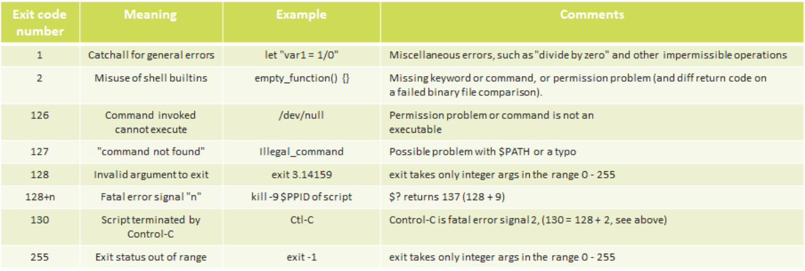
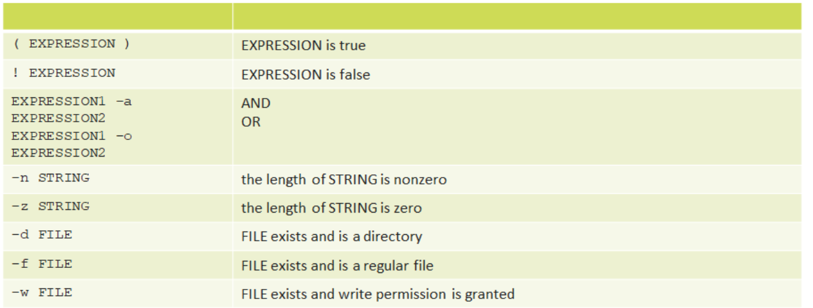
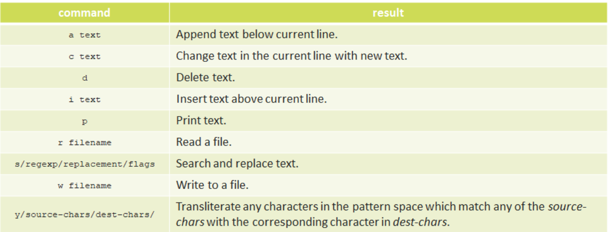

# Shell Script

A **script** is a file containing a list of system commands executed sequentially.
It avoids retyping commands repeatedly.

## Shebang (`#!`)

The **shebang** at the top of a script specifies the interpreter used to run it.
Syntax:
  ```bash
  #!<path-to-interpreter>
  ```

### Examples

```bash
#!/bin/sh
#!/bin/bash
#!/usr/bin/perl
#!/usr/bin/env python
#!/bin/sed -f
#!/bin/awk -f
```

## Running a Script

* Using interpreter:

  ```bash
  sh scriptname
  bash scriptname
  ```

* Make script executable:

  ```bash
  chmod +x scriptname
  ```

* Run directly:

  ```bash
  ./scriptname
  ```
---
<br>


## Shell `set` Command

- **Options** modify shell or script behavior.
- Use the `set` command to enable or disable options inside a script.

### Enable Options
```bash
set -o option-name
set -option-abbrev
````

✅ Both are equivalent:

```bash
set -o verbose
set -v
```

### Disable Options

```bash
set +o option-name
set +option-abbrev
```

Example:

```bash
set +o verbose
set +v
```

---

### Example: Exit on Error (`set -e`)

```bash
#!/bin/bash
set -e

echo "Check non-existing file"
cat non-existing-file.txt
echo "moving on"
```

**Output:**

* Script stops immediately when an error occurs.
---
<br>

## Exit Codes
An **exit code** (or exit status) is a number returned by a command or script that indicates **success or failure**.

- $? stores the exit code of the last executed command.


---
<br><br>

# Special Characters in Bash

A **special character** is a character that has a **meaning beyond its literal value** in Bash.

- It performs a **specific function** instead of being treated as normal text.
- Along with **commands** and **keywords**, special characters are important building blocks of Bash scripts.

## Examples of Special Characters

| Character | Meaning |
|------------|---------|
| `#` | Comment |
| `$` | Variable value |
| `&` | Run command in background |
| `*` | Wildcard (matches multiple characters) |
| `?` | Matches single character |
| `>` | Redirect output |
| `<` | Redirect input |
| `;` | Separate commands |
---
<br>


# Bash Variables & String Manipulation 

## Variables
- A **variable** stores data in memory using a name (label).

### Assignment
```bash
var=value
var2="one two three"
var3=one\ two\ three
````

### Referencing Variables

```bash
echo $var
echo ${var}
```

### Indirect Referencing

```bash
var=value
value=hello
eval b=\$$var
echo $b
```

---

## Variable Types in Bash

* Bash has **no strict data types**.
* Variables are treated as **strings**.
* Arithmetic works if value contains digits.

```bash
n=6/3
echo $n     # 6/3

declare -i n
n=6/3
echo $n     # 2
```

---

## String Manipulation

### Length
- ${#var} - $var length. For an array, ${#array} is the length of the first element in the array.   

```bash
${#var}
```

### Substring
- ${var:position:length} - extracts $length characters of substring from $var at $position. 0-based indexing.

```bash
${var:position:length}
```

### Remove Pattern
- ${var#Pattern} - remove from $var the shortest part of $pattern that matches the front end of $var.
- ${var##Pattern} - remove from $var the longest part of $pattern that matches the front end of $var.
- ${var%Pattern} - deletes shortest match of $Pattern from back of $var.
- ${var%%Pattern} - deletes longest match of $Pattern from back of $string.

```bash
${var#pattern}   # shortest front match
${var##pattern}  # longest front match
${var%pattern}   # shortest back match
${var%%pattern}  # longest back match
```

### Replace
- ${var/Pattern/Replacement} - replace first match of - $Pattern with $Replacement. If $Replacement is omitted, then the first match of $Pattern is replaced by nothing, that is, deleted.
- ${var//Pattern/Replacement} - replace all matches of $Pattern with $Replacement.

```bash
${var/pat/rep}    # first match
${var//pat/rep}   # all matches
```

### Replace Prefix / Suffix
- ${var/#Pattern/Replacement} - if prefix of $var matches $Pattern, then substitute $Replacement for $Pattern.
- ${var/%Pattern/Replacement} - if suffix of $var matches $Pattern, then substitute $Replacement for $Pattern.

```bash
${var/#pat/rep}
${var/%pat/rep}
```
---

## Parameter Substitution

### Default Value
- ${parameter-default}, ${parameter:-default} - if $parameter not set, use default. ${parameter-default} and ${parameter:-default} are almost equivalent. The extra ":" makes a difference only when $parameter has been declared, but is null.
```bash
${var-default}
${var:-default}
```

### Assign Default
- ${parameter=default}, ${parameter:=default} - if $parameter not set, set it to $default. 
- ${parameter=default}, ${parameter:=default} - if $parameter not set, set it to $default. Both forms nearly equivalent. The ":" makes a difference only when $parameter has been declared and is null.
```bash
${var=default}
${var:=default}
```

### Alternate Value
- ${parameter+alt_value} and ${parameter:+alt_value} allow you to substitute an alternative value if a variable is set. 
- ${parameter+alt_value} – returns alt_value if the variable is set, even if it is empty.
- ${parameter:+alt_value} – returns alt_value only if the variable is set and not empty.
```bash
${var+alt}
${var:+alt}
```

### Error if Not Set

```bash
${var?error}
${var:?error}
```

---

## Variable Types

### 1. Local Variables

Visible only inside functions.

```bash
local var=value
```

### 2. Environment Variables

Affect shell behavior.

```bash
export MYVAR=value
env   # view variables
```

Locations:

* `/etc/environment`
* `~/.bashrc`
* `~/.bash_profile`

---

## Positional Parameters

Command-line arguments:

```bash
$0  # script name
$1  # first argument
$2  # second argument
```

Special:

```bash
$#   # number of arguments
$@   # all arguments
$*   # all arguments
```

---

## Arrays

### Declare Array

```bash
my_array=(zero one two)
declare -a arr
```

### Assign Element

```bash
my_array[3]=three
```

### Access Element

```bash
echo ${my_array[3]}
```

### All Elements

```bash
echo ${my_array[@]}
echo ${my_array[*]}
```

### Array Length

```bash
echo ${#my_array[@]}
```
---
<br><br>

# Bash Conditions

## 1. `test` Command / `[ ]`
The **`test` command** or **square brackets `[ ]`** are used to evaluate conditions such as comparisons and file checks.

- `[ ]` is a synonym for `test`.
- Returns **exit status**:
  - `0` → true
  - `1` → false

### Syntax
```bash
test EXPRESSION
[ EXPRESSION ]
````

### Examples

```bash
ls
file.txt

test -f file.txt && echo "File exists"
# Output: File exists

[ -f file.txt ] && echo "Indeed"
# Output: Indeed

[ -f file1.txt ] || echo "No such file"
# Output: No such file
```

### Checking Exit Status

```bash
ifup eth0
[ $? -ne 0 ] && rc=1
```

## Test command expression


---

# 2. Extended Test `[[ ]]`

Bash introduced **`[[ ... ]]`** as an improved test command.

* `[[` is a **keyword**, not a command.
* Supports operators like `&&`, `||`, `<`, `>` inside the condition.
* Helps prevent many logic errors.

### Example

```bash
string_with_spaces="some spaces here"

if [[ -n $string_with_spaces ]]; then
  echo "The string is non-empty"
fi
```

Output:

```
The string is non-empty
```

Using `[ ]` may cause errors with spaces.

---

# 3. Arithmetic Evaluation `(( ))` and `let`

The **`(( ))`** and **`let`** constructs evaluate arithmetic expressions.

* If result ≠ 0 → exit status `0` (true)
* If result = 0 → exit status `1` (false)

### Example

```bash
(( 0 && 1 ))
echo $?
# Output: 1
```

```bash
var=-2
(( var+=2 ))
echo $?
# Output: 1
```

---

# 4. `if / then` Construct

The **if statement** executes commands if the condition returns exit status `0`.

### Syntax

```bash
if [ condition ]; then
  command1
elif [ condition ]; then
  command2
else
  command3
fi
```

### Example

```bash
if [ -f file.txt ]; then
  echo "File exists"
else
  echo "File not found"
fi
```

---

# 5. `case` Statement

The **case statement** is used to match patterns and execute commands based on the result.

### Syntax

```bash
case EXPRESSION in
  pattern1)
    command
    ;;
  pattern2)
    command
    ;;
  *)
    default command
    ;;
esac
```

### Example

```bash
case "$1" in
  start)
    echo "Starting service"
    ;;
  stop)
    echo "Stopping service"
    ;;
  *)
    echo "Usage: start | stop"
    ;;
esac
```

---

# 6. List Constructs

List constructs allow chaining multiple commands.

## AND List (`&&`)

Next command runs **only if previous command succeeds**.

```bash
command1 && command2 && command3
```

Example:

```bash
mkdir test && cd test && touch file.txt
```

---

## OR List (`||`)

Next command runs **only if previous command fails**.

```bash
command1 || command2
```

Example:

```bash
[ -f file.txt ] || echo "File not found"
```
---
<br><br>


# Bash Redirection

## Default Input/Output Files

There are three default files always open:

- **stdin (0)** → keyboard input  
- **stdout (1)** → screen output  
- **stderr (2)** → error messages on screen  

These are called **file descriptors**.

Additional file descriptors **3–9** can be used for temporary files or redirections.

---

# 1. Redirecting Input `<`

Input redirection sends the content of a file as input to a command.

### Syntax
```bash
command < filename
````

### Example

```bash
grep search-word < filename
# same as
cat filename | grep search-word
```

---

# 2. Redirecting Output `>`

Output redirection sends command output to a file.

* Creates the file if it does not exist.
* If it exists, it **overwrites the file**.

### Example

```bash
ls -la > list_of_files.txt
```

Truncate a file to zero length:

```bash
: > filename
```

or

```bash
> filename
```

---

# 3. Appending Output `>>`

Appends output to a file instead of overwriting it.

### Example

```bash
echo one > file
cat file
# one

echo two >> file
cat file
# one
# two
```

---

# 4. Redirecting stdout and stderr

Both **standard output (1)** and **error output (2)** can be redirected.

### Syntax

```bash
&> filename
```

Equivalent to:

```bash
> filename 2>&1
```

### Example

```bash
java -version &> version
cat version
```

Redirect only errors:

```bash
java -version 2> version
```

Suppress all output:

```bash
ps aux &> /dev/null
```

---

# 5. Pipe `|`

A **pipe** sends the output of one command as input to another command.

### Example

```bash
cat *.txt | sort | uniq > result-file
```

Check exit codes of commands in a pipe:

```bash
echo ${PIPESTATUS[@]}
```

---

# 6. `tee` Command

`tee` writes output **to both a file and the terminal**.

### Example

```bash
cat *.txt | tee -a result-file
```

---

# 7. Here Document `<<`

A **here document** reads input until a specified delimiter is reached.

### Example

```bash
cat <<EOF > unit.file
Hello
This is a file
EOF
```

---

# 8. Here String `<<<`

A **here string** sends a single string as input to a command.

### Example

```bash
grep "txt" <<< "$VAR"
```

Instead of:

```bash
echo "$VAR" | grep txt
```

---

# 9. Special Filenames

Bash supports special files such as network connections.

### Example

```bash
cat </dev/tcp/time.nist.gov/13
```

Open a TCP connection:

```bash
exec 5<>/dev/tcp/www.tut.by/80
echo -e "GET / HTTP/1.0\n" >&5
cat <&5
```

---

# 10. Redirecting Code Blocks

Redirection can be applied to loops or blocks.

### Example

```bash
while read name; do
  echo $name
done < file
```

---
<br><br>


# Bash Functions

## Function

A **function** is a subroutine, a code block that implements a set of operations, a **"black box" that performs a specified task**. Wherever there is repetitive code, when a task repeats with only slight variations in procedure, then consider using a function.

### Syntax
```bash
function_name () {
  command...
}
````

Functions may **process arguments passed to them and return an exit status to the script for further processing**.

### Calling a Function

```bash
function_name $arg1 $arg2
```

The function refers to the passed arguments **by position**, just like positional parameters:

* `$1` → first argument
* `$2` → second argument

### Example

```bash
print_args () {
  local var1=$1
  local var2=$2
  echo "first function argument is:" $var1
  echo "second function argument is:" $var2
}

print_args /tmp hello
```

### Output

```
first function argument is: /tmp
second function argument is: hello
```

---

# Exit Status

Functions return a value called an **exit status**.

This is similar to the exit status returned by a command.

* If successful → **0**
* If error → **non-zero value**

The exit status can be accessed using:

```bash
$?
```

If not explicitly specified, the function returns the **exit status of the last executed command**.

---

# `return` Statement

`return` **terminates a function** and optionally sends an integer value back to the calling script.

That value becomes the **exit status** and is stored in `$?`.

### Example

```bash
#!/bin/bash

retfunc() {
  echo "this is retfunc()"
  return 1
}

exitfunc() {
  echo "this is exitfunc()"
  exit 1
}

retfunc
echo "We are still here"

exitfunc
echo "We will never see this"
```

### Output

```
this is retfunc()
We are still here
this is exitfunc()
```

### Explanation

* `return 1` → exits **only the function**
* `exit 1` → **terminates the entire script**
---
<br><br>

# AWK Command

`awk` is a powerful **text-processing tool in Linux/Unix** used for searching, filtering, and processing structured text files such as logs, CSV files, and tables.

It works **line by line** and **field by field**, making it ideal for processing tabular data.

---

## 1. Basic Idea of AWK

The main workflow of `awk`:

1. Read input **line by line**
2. Check if the line **matches a pattern**
3. If it matches → **perform an action**

General structure:

```

pattern { action }

```

If the pattern is true, the action runs.

---

## 2. Basic Syntax

```

awk [options] 'program' input-file

```

Example file `data.txt`

```

Nitin 23 MCA
Rahul 21 BCA
Aman 22 MCA

```

Example command:

```

awk '{print $1}' data.txt

```

Output:

```

Nitin
Rahul
Aman

```

Explanation:

- `awk` reads the file line by line
- `$1` represents the **first field**
- `print` displays the value

---

## 3. How AWK Splits Fields

By default, `awk` splits lines using **whitespace (space or tab)**.

Example line:

```

Nitin 23 MCA

```

Fields:

```

$1 = Nitin
$2 = 23
$3 = MCA

```

Example:

```

awk '{print $1,$3}' data.txt

```

Output:

```

Nitin MCA
Rahul BCA
Aman MCA

```

---

## 4. Changing Field Separator (`-F`)

If your data uses another separator like **comma**, you can change the field separator.

Example file `data.csv`

```

Nitin,23,MCA
Rahul,21,BCA
Aman,22,MCA

```

Command:

```

awk -F "," '{print $1,$3}' data.csv

```

Output:

```

Nitin MCA
Rahul BCA
Aman MCA

```

Explanation:

```

-F ","   → sets comma as field separator

```

---

## 5. Pattern Matching

You can run actions only for lines that match a condition.

Example:

```

awk '$3 == "MCA" {print $1}' data.txt

```

Output:

```

Nitin
Aman

```

Explanation:

```

$3 == "MCA"

```

This means the **third column must contain "MCA"**.

---

## 6. Using Regular Expressions

Patterns can also be written using **regular expressions**.

Example:

```

awk '/Rahul/ {print}' data.txt

```

Output:

```

Rahul 21 BCA

```

Multiple matches:

```

awk '/Nitin|Aman/ {print}' data.txt

```

Output:

```

Nitin 23 MCA
Aman 22 MCA

```

---

## 7. Multiple Patterns and Actions

You can define multiple rules.

```

awk '
$3=="MCA" {print $1,"is MCA student"}
$3=="BCA" {print $1,"is BCA student"}
' data.txt

```

Output:

```

Nitin is MCA student
Rahul is BCA student
Aman is MCA student

```

---

## 8. BEGIN Block

`BEGIN` runs **before reading the input file**.

Example:

```

awk '
BEGIN {print "Student List"}
{print $1,$2}
' data.txt

```

Output:

```

Student List
Nitin 23
Rahul 21
Aman 22

```

Explanation:

```

BEGIN → executed once before processing starts

```

---

## 9. END Block

`END` runs **after all lines are processed**.

Example:

```

awk '
BEGIN {print "Start"}
{print $1}
END {print "End of File"}
' data.txt

```

Output:

```

Start
Nitin
Rahul
Aman
End of File

```

---

## 10. Counting Lines

You can count the number of lines in a file.

```

awk 'END {print NR}' data.txt

```

Output:

```

3

```

Explanation:

```

NR → Number of Records (line count)

```

---

## 11. Sum Example

Example file:

```

Nitin 100
Rahul 200
Aman 300

```

Command:

```

awk '{sum += $2} END {print sum}' data.txt

```

Output:

```

600

```

Explanation:

```

sum += $2  → add values from second column
END        → print result after processing all lines

```

---

## 12. Full Example Program

```

awk '
BEGIN {print "Student Data"}
$3=="MCA" {print $1,"studies MCA"}
END {print "Processing Finished"}
' data.txt

```

Output:

```

Student Data
Nitin studies MCA
Aman studies MCA
Processing Finished

```

---

## 13. Running AWK from a Script File

Instead of writing long commands, create a separate AWK script.

File: `program.awk`

```

BEGIN {print "Students"}
{print $1,$2}
END {print "Done"}

```

Run:

```

awk -f program.awk data.txt

```

---
<br>

# AWK Built-in Variables

AWK provides several **built-in variables** for handling records (lines), fields (columns), and separators.

---

## Field Variables

| Variable | Meaning |
|--------|--------|
| `$0` | Entire line (record) |
| `$1` | First field |
| `$2` | Second field |
| `$n` | nth field |

Example:

```bash
awk '{print $1}' data.txt
````

---

## NR (Number of Records)

* Keeps count of **input records (lines)** processed.

Example:

```bash
awk '{print NR,$0}' data.txt
```

---

## NF (Number of Fields)

* Number of **fields in the current line**.

Example:

```bash
awk '{print $NF}' data.txt
```

`$NF` prints the **last field**.

---

## FS (Field Separator)

* Defines **how fields are separated in input**.
* Default: **whitespace (space or tab)**.

Example:

```bash
awk -F "," '{print $1,$3}' data.csv
```

---

## RS (Record Separator)

* Defines **record separator (line separator)**.
* Default: **newline (`\n`)**.

---

## OFS (Output Field Separator)

* Separator used when printing fields.
* Default: **space**.

Example:

```bash
awk 'BEGIN{OFS="-"} {print $1,$2}' data.txt
```

Output example:

```
Nitin-23
Rahul-21
```

---

## ORS (Output Record Separator)

* Separator between output lines.
* Default: **newline**.

Example:

```bash
awk 'BEGIN{ORS=" | "} {print $1}' data.txt
```

---

## Short Note

| Variable   | Purpose                 |
| ---------- | ----------------------- |
| `$0,$1,$2` | Access fields           |
| `NR`       | Line number             |
| `NF`       | Number of fields        |
| `FS`       | Input field separator   |
| `RS`       | Input record separator  |
| `OFS`      | Output field separator  |
| `ORS`      | Output record separator |

---
<br><br>


# SED (Stream Editor)

`sed` is a **Stream Editor** used to perform basic transformations on text from a file or pipe.  
It processes input **line by line** and sends the result to **standard output (stdout)**.

- It **does not modify the original file**.
- Output can be saved using **redirection (`>`)**.
- Commonly used for **find and replace operations**.

---

## Syntax

```bash
sed OPTIONS... [SCRIPT] [INPUTFILE...]
````

---

## Example: Replace Text

Replace `hello` with `world` in `input.txt`.

```bash
sed 's/hello/world/' input.txt > output.txt
```

Explanation:

* `s` → substitute command
* `hello` → text to find
* `world` → replacement text

---

## Using Standard Input

If no input file is provided, `sed` reads from **standard input (stdin)**.

These commands are equivalent:

```bash
sed 's/hello/world/' input.txt > output.txt
```

```bash
sed 's/hello/world/' < input.txt > output.txt
```

```bash
cat input.txt | sed 's/hello/world/' > output.txt
```

---

## Important SED Option

### `-n` , `--quiet` , `--silent`

By default, `sed` prints each processed line automatically.

Using `-n` disables automatic printing.
Output appears **only when explicitly printed using `p` command**.

Example:

```bash
sed -n 's/hello/world/p' input.txt
```

Explanation:

* `-n` → disable automatic output
* `p` → print only matched lines

---
<br>

# SED Script Overview

A **sed program** consists of one or more **sed commands** passed using:

- `-e` or `--expression`
- `-f` or `--file`
- or directly as the first argument.

## Syntax

```bash
sed [OPTIONS] '[addr]X[options]' inputfile
````

* **[addr]** → Optional line address (where command applies)
* **X** → Single-letter sed command
* **[options]** → Extra options for some commands

---

## Address Types

| Address Type       | Example      |
| ------------------ | ------------ |
| Line number        | `5d`         |
| Range of lines     | `10,20d`     |
| Regular expression | `/pattern/d` |

---

## Example 1: Delete Lines by Range

Delete lines **30 to 35**.

```bash
sed '30,35d' input.txt > output.txt
```

* `30,35` → address range
* `d` → delete command

---

## Example 2: Delete Lines by Pattern

Delete lines starting with **foo**.

```bash
sed '/^foo/d' input.txt > output.txt
```

* `/^foo/` → regex pattern
* `d` → delete

---

## Multiple Commands

Commands can be separated by **semicolon (`;`)** or **new line**.

Example:

```bash
sed '/^foo/d; s/hello/world/' input.txt > output.txt
```

Operations performed:

1. Delete lines starting with `foo`
2. Replace `hello` with `world`

---

## Important Note

Commands **`a` (append), `c` (change), and `i` (insert)** cannot be separated using `;`.

They must:

* End with a **newline**
* Or be placed **at the end of the script**

---
<br>

# SED Addresses Overview (Short)

**Addresses** in `sed` specify the line(s) where a command should be executed.

---

## 1. Line Number Address
Apply a command to a specific line.

```bash
sed '144s/hello/world/' input.txt > output.txt
````

Replaces `hello` with `world` **only on line 144**.

---

## 2. No Address (All Lines)

If no address is specified, the command runs on **every line**.

```bash
sed 's/hello/world/' input.txt > output.txt
```

Replaces `hello` with `world` in **all lines**.

---

## 3. Pattern Address (Regex)

Use a **regular expression** to match lines.

```bash
sed '/apple/s/hello/world/' input.txt > output.txt
```

Replaces `hello` with `world` **only in lines containing `apple`**.

---

## 4. Regular Expression Syntax

```text
/regexp/
```

Matches lines containing `regexp`.

Example:

```bash
sed '/error/d' file.txt
```

Deletes lines containing `error`.

---

## 5. Using Different Delimiters

If the pattern contains many `/`, another delimiter can be used.

```bash
sed -n '\%^/home/alice/documents/%p'
sed -n '\;^/home/alice/documents/;p'
```

This avoids escaping `/`.

---

## 6. Negation with `!`

`!` selects lines **not matching the address**.

```bash
sed '/apple/!s/hello/world/' input.txt > output.txt
```

Replaces `hello` with `world` **only in lines NOT containing `apple`**.

---
<br>

# Common SED Commands



## 1. Append Text (`a`)
Add text **after a specific line**.

```bash
seq 3 | sed '2a hello'
````

Output:

```
1
2
hello
3
```

---

## 2. Change Lines (`c`)

Replace a **range of lines** with new text.

```bash
seq 10 | sed '2,9c hello'
```

Output:

```
1
hello
10
```

---

## 3. Delete Line (`d`)

Delete a specific line.

```bash
seq 3 | sed '2d'
```

Output:

```
1
3
```

---

## 4. Insert Text (`i`)

Insert text **before a line**.

```bash
seq 3 | sed '2i hello'
```

Output:

```
1
hello
2
3
```

---

## 5. Read File (`r`)

Insert the content of a file after a line.

```bash
seq 3 | sed '2r /etc/hostname'
```

---

## 6. Transliterate Characters (`y`)

Replace characters **one-to-one**.

```bash
echo hello world | sed 'y/abcdefghij/0123456789/'
```

Output:

```
74llo worl3
```

---

# Substitute Command (`s`)

Most important `sed` command.

Syntax:

```bash
s/regexp/replacement/flags
```

Example:

```bash
sed -i 's/erors/errors/g' input.txt
```

* `regexp` → pattern to match
* `replacement` → new text
* `g` → replace **all occurrences**

---

## Special Replacement Symbols

| Symbol      | Meaning             |
| ----------- | ------------------- |
| `&`         | Entire matched text |
| `\1` - `\9` | Captured groups     |

---

## Common Flags

| Flag | Meaning                |
| ---- | ---------------------- |
| `g`  | Replace all matches    |
| `i`  | Case-insensitive match |

---

## Practical Examples

Replace **bash login shell with false**:

```bash
sudo sed -i 's/bash/false/g' /etc/passwd
```

Restore bash only for **vagrant user**:

```bash
sudo sed -i '/vagrant/s/false/bash/g' /etc/passwd
```
