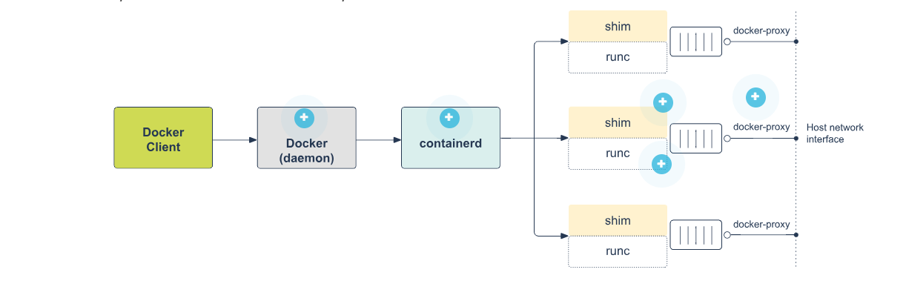
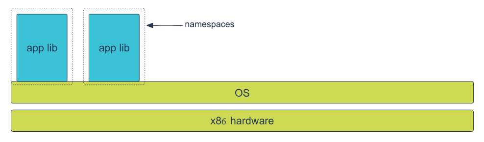
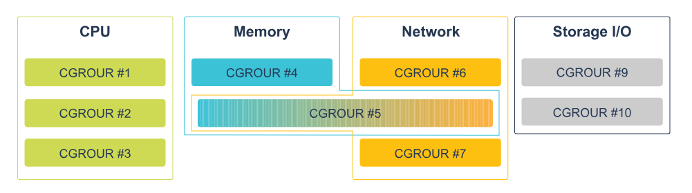
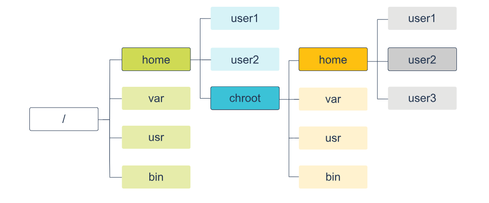

# Docker Architecture and Core Concepts

## **Docker Architecture Overview**

Docker follows a **client-server architecture** where components communicate through a REST API over UNIX sockets or network interfaces.

```
┌─────────────────┐    REST API    ┌─────────────────┐
│  Docker Client  │ ◄─────────────► │  Docker Daemon  │
│    (docker)     │                 │   (dockerd)     │
└─────────────────┘                 └─────────────────┘
                                            │
                                            ▼
                                    ┌─────────────────┐
                                    │ Docker Objects  │
                                    │ • Images        │
                                    │ • Containers    │
                                    │ • Networks      │
                                    │ • Volumes       │
                                    └─────────────────┘
```

## **Core Components**

### **1. Docker Client (docker)**
- **Purpose**: Primary interface for user interaction
- **Functions**:
  - Sends commands to Docker daemon via REST API
  - Processes commands like `docker run`, `docker build`, `docker pull`
  - Can communicate with multiple daemons (local or remote)
  - Translates user commands into API calls

### **2. Docker Daemon (dockerd)**
- **Purpose**: Background service that does the heavy lifting
- **Functions**:
  - Listens for Docker API requests
  - Manages Docker objects (images, containers, networks, volumes)
  - Communicates with other daemons for distributed services
  - Handles container lifecycle management

<br>

# 3. Docker Objects

## 1️⃣ Docker Images

A **Docker Image** is a **read-only template used to create containers**.
It contains the application code, runtime, libraries, dependencies, and configuration required to run an application.

Images are built in **multiple layers**, where each layer represents a change such as installing packages or adding files.

### Structure of a Docker Image

```
┌─────────────────────────────────┐
│           Docker Image          │
│  ┌─────────────────────────────┐ │
│  │        Layer 4 (App)        │ │ ← Your application code
│  ├─────────────────────────────┤ │
│  │      Layer 3 (Config)       │ │ ← Configuration files
│  ├─────────────────────────────┤ │
│  │    Layer 2 (Dependencies)   │ │ ← Libraries and packages
│  ├─────────────────────────────┤ │
│  │     Layer 1 (Base OS)       │ │ ← Base OS like Ubuntu/Alpine
│  └─────────────────────────────┘ │
└─────────────────────────────────┘
```

### Characteristics

* **Read-only template** used to create containers
* Built in **layered structure** for efficiency and reuse
* **Immutable** once created (cannot be modified directly)
* Can be **based on other images**
* Created using a **Dockerfile**

## Docker Image Commands

| Command          | Description                 |
| ---------------- | --------------------------- |
| `docker images`  | List all images             |
| `docker build`   | Build image from Dockerfile |
| `docker import`  | Create image from tarball   |
| `docker commit`  | Create image from container |
| `docker rmi`     | Remove image                |
| `docker save`    | Save image as tar archive   |
| `docker load`    | Load image from tar archive |
| `docker history` | Show image layer history    |

⚠️ An image **cannot be removed if a container is using it**.


---
<br>

## 2️⃣ Docker Containers

A **Docker Container** is a **running instance of a Docker image**.
It allows the application inside the image to run in an **isolated environment**.

Containers add a **read-write layer on top of the image**, where temporary changes occur while the container is running.

### Structure of a Container

```
┌─────────────────────────────────┐
│         Running Container       │
│  ┌─────────────────────────────┐ │
│  │    Read-Write Layer         │ │ ← Container changes
│  ├─────────────────────────────┤ │
│  │                             │ │
│  │        Docker Image         │ │ ← Base image (read-only)
│  │        (Read-Only)          │ │
│  │                             │ │
│  └─────────────────────────────┘ │
└─────────────────────────────────┘
```
## What a Container Includes
- Filesystem – Usually a Linux-based OS environment (Ubuntu, Alpine, etc.).
- Installed Software – Application code, libraries, and required packages.
- Runtime Configurations – External volumes, exposed ports, and environment variables.

### Characteristics

* **Runnable instance of an image**
* Has a **temporary writable layer** on top of the image
* **Isolated** from other containers and the host system
* Can be **started, stopped, moved, or deleted**
* Changes **disappear when the container is removed** unless stored in volumes

---
<br><br>

# Docker Infrastructure


When a user runs a Docker command to start a container, several internal components work together to create and run the container.

## Execution Flow

When you ask the Docker daemon to start a new service, the following sequence happens:

1. The **Docker Daemon** receives the request from the Docker CLI along with all required options.

2. The **Docker Daemon** sends the container creation request to **containerd**.

3. **containerd** prepares the container environment and communicates with **containerd-shim**.

4. **containerd-shim** starts the container by executing **runC**.

5. **runC** creates the container using Linux kernel features and starts the container process.

6. After the container starts, **runC exits**.

7. **containerd-shim** continues running in the background and monitors the container to check whether it is working properly.

---
<br>

# Docker Infrastructure Components

## 1. Docker Daemon (dockerd)

### Definition

The **Docker Daemon** is the main background service that manages Docker operations.

### Functions

* Receives commands from Docker CLI.
* Builds and manages images.
* Creates, runs, and stops containers.
* Manages Docker networking and volumes.
* Sends container execution requests to **containerd**.

---

## 2. containerd

### Definition

**containerd** is a container runtime responsible for managing the container lifecycle.

It is part of the **Cloud Native Computing Foundation** ecosystem.

### Functions

* Pulls images from registries.
* Creates and manages containers.
* Handles container storage and networking.
* Communicates with **runC** through containerd-shim.

---

## 3. containerd-shim

### Definition

The **containerd-shim** is a lightweight process that acts as a bridge between **containerd** and the running container.

### Functions

* Starts the container using **runC**.
* Maintains the container's input/output streams.
* Monitors the container's status.
* Keeps the container running even if **containerd** or Docker daemon restarts.

---

## 4. runC

### Definition

**runC** is the low-level runtime responsible for actually creating and running containers.

It follows container standards defined by the **Open Container Initiative**.

### Functions

* Creates containers using Linux kernel features.
* Configures namespaces for isolation.
* Applies control groups (cgroups) for resource limits.
* Starts the container process and then exits.

---
<br><br>

# Isolation Technologies: Functional Requirements

Containerization requires **isolation technologies** to create separate environments for applications running on the same machine.
These technologies ensure that containers are **isolated from the host system and from other containers**, improving security and stability.

Isolation reduces the **attack surface of the host system** and ensures that containers cannot interfere with each other or access resources they are not allowed to use.

---
<br>

# Types of Isolation Technologies in Docker

Docker provides several mechanisms to ensure container isolation and resource management.

---

## 1. Namespaces

### Definition

**Namespaces** are a Linux kernel feature that provides **process isolation** by creating separate environments for containers.

When a container runs, Docker creates a set of namespaces so that the container only sees its own processes, network interfaces, and system resources.



### Purpose

* Ensures a process inside a container **cannot see or interact with processes outside the container**.
* Makes each container appear as if it is running on its own system.

### Types of Linux Namespaces

| Namespace   | Purpose                             |
| ----------- | ----------------------------------- |
| MNT (Mount) | Isolates filesystem mount points    |
| UTS         | Isolates hostname and domain name   |
| IPC         | Manages inter-process communication |
| PID         | Provides process isolation          |
| NET         | Isolates network interfaces         |
| USER        | Isolates user and group IDs         |

---
<br>

## 2. Control Groups (cgroups)

### Definition

**Control Groups (cgroups)** are used to **limit, allocate, and monitor system resources** for containers.



### Purpose

They ensure containers only use the resources assigned to them and prevent one container from consuming all system resources.

### Resources Controlled

* CPU usage
* Memory allocation
* Disk I/O
* Network bandwidth
---
<br>

## 3. Chroot

### Definition

**Chroot (Change Root)** is a technique that restricts a process to a **specific part of the filesystem**.



### Purpose

A process inside a container can **only access files within its designated filesystem** and cannot access the rest of the host filesystem.

### Benefit

Improves security by isolating the container's filesystem from the host system.

---
<br>

# Additional Isolation Mechanisms in Docker

## Process Capabilities

Provides specific **permissions to processes** inside the container so they can interact with the kernel without having full root privileges.

---

## Virtual Ethernet (veth)

Provides containers with a **virtual network interface**, allowing them to communicate with networks and other containers.

---

## Port Binding

Allows multiple containers to expose services using the **same internal port**, while mapping them to different host ports.

---

## Volumes

Provide **persistent storage** so container data remains available even if the container stops or is removed.

---

## Docker Network

Allows containers to **communicate with each other using IP addresses or service names**.

---
<br><br>

# Docker Storage (Graph) Drivers

## Definition

Docker **Storage (Graph) Drivers** manage how Docker **stores and handles image layers and container data** on the host system.
They maintain the **layered structure of images** and manage the **read-write layer of containers**.

---

# Union File System (UnionFS)

## Definition

A **Union File System** allows multiple directories (called layers) to be **combined into a single virtual filesystem**.

## Working

* Docker images are built in **multiple layers**.
* These layers are **read-only**.
* When a container starts, Docker adds a **read-write layer** on top of the image layers.
* Any changes made by the container are stored in this **container layer**.

## Benefits

* Efficient storage through **layer sharing**
* Faster image builds
* Reduced duplication of files

---

# Copy-on-Write (CoW)

## Definition

**Copy-on-Write (CoW)** is a mechanism where files are **shared between layers until modification is required**.

## Working

1. If a file exists in a lower image layer → it is reused.
2. When modification is needed → Docker copies the file to the **container’s read-write layer**.
3. The copied file is then modified.

## Advantages

* Reduces disk usage
* Improves efficiency by avoiding unnecessary duplication

---

# Container Layer

When a container starts from an image:

* All image layers become **read-only**.
* Docker creates a **thin read-write layer** on top.
* All **new or modified files** are stored in this writable layer.

Example:

```
Application Layer (Read-Write)  ← Container Layer
Tomcat Layer (Read-Only)
Java Layer (Read-Only)
System Updates (Read-Only)
Base OS Layer (Read-Only)
```

---

# Disadvantages

* **Performance issues when modifying large files**
* If a large file (e.g., **5 GB database**) is changed even slightly:

  * Docker copies the **entire file to the writable layer**
  * This increases storage usage and image size

### Best Practice

Use **small and lightweight images** (around **100 MB**) and avoid modifying large files inside containers.

---

# Docker Graph Drivers

## Definition

A **Graph Driver** is responsible for **managing the layered filesystem structure of Docker images and containers**.

It controls how layers are **stored, shared, and accessed**.

---

# Common Docker Storage Drivers

## 1. VFS

### Description

* Does **not use UnionFS or Copy-on-Write**
* Each layer is stored as a full copy

### Usage

* Mainly used for **testing and validation**

### Limitation

* **Poor performance**
* Not recommended for production

---

## 2. AUFS (Advanced Multi-Layered File System)

### Description

* Used mainly in **Ubuntu and Debian**
* Supports **layered filesystems**

### Advantages

* Allows containers to share **memory pages and libraries**

### Limitation

* **No disk quota support**

---

## 3. Overlay2

### Description

* **Recommended and default storage driver**
* Supported by most Linux distributions

### Advantages

* Better performance
* Improved stability
* Efficient sharing of libraries between containers

---

## 4. Device Mapper

### Description

* Works at the **block storage level**

### Characteristics

* Requires **manual configuration**
* Performance depends on system configuration

### Limitation

* Complex setup

---

## 5. Btrfs

### Description

* Uses the **Btrfs filesystem**

### Features

* Supports **advanced storage features**
* Provides **quota management**

### Limitation

* Not supported on some systems like **RedHat**

---
<br><br>

# Docker Daemon, Docker Hub, Registry & Image Commands

## 1. Docker Version & Information Commands

| Command | Description |
|-------|-------------|
| `docker --version` | Shows Docker client version |
| `docker version` | Shows detailed client and server version |
| `docker version --format '{{ .Server.Version }}'` | Displays only Docker server version |
| `docker version --format '{{json .}}'` | Shows version info in JSON format |
| `docker info` | Displays system-wide Docker information |
| `docker info --format '{{json .}}'` | Docker info in JSON format |

Example:
```bash
docker version
````

---

# 2. Docker Hub & Registry Commands

| Command                 | Purpose                      |
| ----------------------- | ---------------------------- |
| `docker login`          | Login to Docker registry     |
| `docker logout`         | Logout from registry         |
| `docker search <image>` | Search images on Docker Hub  |
| `docker pull <image>`   | Download image from registry |
| `docker push <image>`   | Upload image to registry     |

---

# 3. Configuring Docker Daemon

Docker daemon can be configured in **two ways**:

1. **Command-line flags**
2. **JSON configuration file**

### Configuration File Location

| OS      | Path                                             |
| ------- | ------------------------------------------------ |
| Linux   | `/etc/docker/daemon.json`                        |
| Windows | `C:\ProgramData\docker\config\daemon.json`       |
| Mac     | Docker Desktop → Preferences → Daemon → Advanced |

### Example `daemon.json`

```json
{
  "debug": true,
  "hosts": ["tcp://192.168.59.3:2376"],
  "tls": true
}
```

⚠️ Do not specify the same option in both **flags and JSON** or Docker daemon will fail to start.

---

# 4. Docker Storage Directory

Docker stores its data in:

```
/var/lib/docker
```

This directory contains images, containers, volumes, and layers.
⚠️ It should **not be modified manually**.

---
