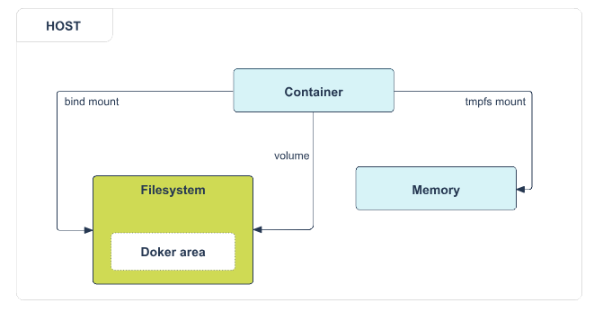

# Docker Data Management Guide

## Overview

Docker containers are **ephemeral** by design - they're meant to be short-lived and disposable. Any data created inside a container during runtime is lost when the container stops. To persist data and share it between containers and the host system, Docker provides three storage mechanisms:

1. **Volumes** (Recommended)
2. **Bind Mounts**
3. **tmpfs Mounts** (Linux only)



---

## 1. Docker Volumes (Recommended Approach)

### What are Docker Volumes?
Volumes are **Docker-managed storage** that exists outside the container's filesystem. They're stored in a part of the host filesystem managed by Docker (`/var/lib/docker/volumes/` on Linux).

### Key Advantages:
- **Platform independent** - Work on both Windows and Linux
- **Docker-managed** - Can be managed via Docker CLI commands
- **Portable** - Easy to backup, migrate, and share between containers
- **Secure sharing** - Multiple containers can safely access the same volume
- **Remote storage support** - Can be stored on remote hosts or cloud providers
- **Pre-population** - New volumes can be pre-populated by containers

### Volume Commands:
```bash
# Create a volume
docker volume create my-volume

# List volumes
docker volume ls

# Inspect volume details
docker volume inspect my-volume

# Remove a volume
docker volume rm my-volume

# Remove unused volumes
docker volume prune
```

### Using Volumes with Containers:
```bash
# Using --mount flag (recommended)
docker run -d --name nginx-container \
  --mount source=nginx-logs,target=/var/log/nginx \
  -p 8080:80 nginx

# Using -v flag (shorter syntax)
docker run -d --name nginx-container \
  -v nginx-logs:/var/log/nginx \
  -p 8080:80 nginx
```

### Best Use Cases for Volumes:
- Sharing data between multiple containers
- When host directory structure is uncertain
- Storing data on remote hosts or cloud providers
- Need for data backup and migration
- Database storage
- Application logs that need persistence

---

## 2. Bind Mounts

### What are Bind Mounts?
Bind mounts **directly link** a specific file or directory on the host machine to a path inside the container. The host path must exist beforehand.

### Characteristics:
- **Host-dependent** - Relies on specific host filesystem structure
- **High performance** - Direct access to host filesystem
- **Limited management** - Cannot use Docker CLI commands to manage
- **Full host path required** - Must specify complete path on host

### Syntax Comparison:

**Using --mount (verbose, recommended for beginners):**
```bash
docker run -d --name nginx-container \
  --mount type=bind,source=/home/user/nginx-logs,target=/var/log/nginx \
  -p 8080:80 nginx
```

**Using -v (compact syntax):**
```bash
docker run -d --name nginx-container \
  -v /home/user/nginx-logs:/var/log/nginx \
  -p 8080:80 nginx
```

### Read-Only Bind Mounts:
```bash
# Using --mount
docker run -d --name nginx-container \
  --mount type=bind,source=/home/user/config,target=/etc/nginx,readonly \
  nginx

# Using -v
docker run -d --name nginx-container \
  -v /home/user/config:/etc/nginx:ro \
  nginx
```

### Best Use Cases for Bind Mounts:
- **Development environments** - Live code editing
- **Configuration files** - Sharing host config with containers
- **Source code mounting** - Real-time development
- **Build artifacts** - Sharing between development environment and container
- When you need **specific host directory structure**

---

## 3. tmpfs M
ounts (Linux Only)

### What are tmpfs Mounts?
tmpfs mounts store data in the **host's memory (RAM)** rather than on disk. Data is temporary and disappears when the container stops.

### Characteristics:
- **Memory-based** - Stored in RAM only
- **Temporary** - Data lost when container stops
- **High performance** - Faster than disk-based storage
- **Linux only** - Not available on Windows
- **No sharing** - Cannot be shared between containers

### Usage Example:
```bash
docker run -d --name nginx-container \
  --mount type=tmpfs,target=/var/log/nginx,tmpfs-mode=1770 \
  -p 8080:80 nginx
```

### Best Use Cases for tmpfs:
- **Temporary data** - Cache, session data
- **Security sensitive data** - Data that shouldn't persist
- **High-performance requirements** - Frequent read/write operations
- **Large non-persistent state data** - Temporary processing files

---

## Practical Example: Complete Workflow

Let's walk through a complete example using volumes:

```bash
# 1. Create a named volume
docker volume create nginx-data

# 2. Run container with the volume
docker run -d --name web-server \
  --mount source=nginx-data,target=/usr/share/nginx/html \
  -p 8080:80 nginx

# 3. Add content to the volume via another container
docker run --rm \
  --mount source=nginx-data,target=/data \
  busybox sh -c "echo '<h1>Hello from Volume!</h1>' > /data/index.html"

# 4. Verify the content persists
curl http://localhost:8080

# 5. Stop and remove the container
docker stop web-server
docker rm web-server

# 6. Start a new container with the same volume
docker run -d --name web-server-2 \
  --mount source=nginx-data,target=/usr/share/nginx/html \
  -p 8080:80 nginx

# The content is still there!
curl http://localhost:8080
```

---

## Key Differences Summary

| Feature | Volumes | Bind Mounts | tmpfs |
|---------|---------|-------------|-------|
| **Management** | Docker-managed | Host filesystem | Memory-based |
| **Performance** | Good | Excellent | Excellent |
| **Portability** | High | Low | Medium |
| **Sharing** | Multiple containers | Multiple containers | Single container |
| **Persistence** | Permanent | Permanent | Temporary |
| **Platform** | Cross-platform | Cross-platform | Linux only |
| **Use Case** | Production data | Development | Temporary data |

---

## Best Practices

1. **Use volumes for production** - They're Docker-managed and portable
2. **Use bind mounts for development** - Direct access to source code
3. **Use tmpfs for sensitive/temporary data** - Security and performance
4. **Always specify mount type explicitly** when using `--mount`
5. **Use `--mount` syntax for clarity** - More explicit than `-v`
6. **Regular cleanup** - Use `docker volume prune` to remove unused volumes

---

## Additional Notes

### Volume vs Bind Mount Decision Tree
```
Need to persist data?
├── Yes
│   ├── Development environment?
│   │   ├── Yes → Use Bind Mounts
│   │   └── No → Use Volumes
│   └── Production environment? → Use Volumes
└── No
    └── Need high performance? → Use tmpfs
```

### Common Patterns

#### Database Persistence
```bash
# PostgreSQL with volume
docker run -d --name postgres-db \
  --mount source=postgres-data,target=/var/lib/postgresql/data \
  -e POSTGRES_PASSWORD=mypassword \
  postgres:13
```

#### Development Setup
```bash
# Node.js development with bind mount
docker run -d --name node-dev \
  --mount type=bind,source=$(pwd),target=/app \
  -w /app \
  -p 3000:3000 \
  node:16 npm start
```

#### Temporary Cache
```bash
# Redis with tmpfs for cache
docker run -d --name redis-cache \
  --mount type=tmpfs,target=/data \
  redis:6-alpine
```