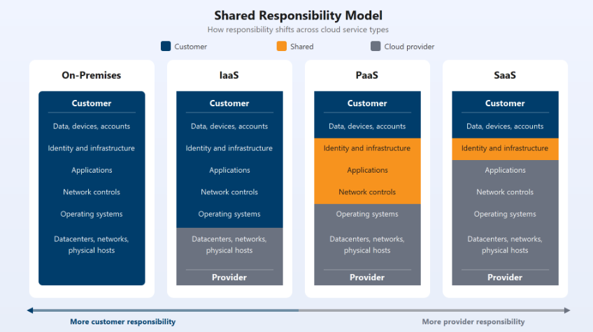

# Cloud Computing
```
Cloud computing is the delivery of computing services like servers, storage, databases, networking, and software over the internet instead of using local systems.
```

## Types of Cloud Services

### ☁ IaaS (Infrastructure as a Service)

**Definition:**  
IaaS provides virtualized computing resources such as servers, storage, and networking over the internet. Users manage the OS, applications, and runtime, while the provider manages the infrastructure.

**Example:**  
Microsoft Azure Virtual Machines, Amazon EC2

---

### 🖥 PaaS (Platform as a Service)

**Definition:**  
- PaaS provides a platform and environment to develop, run, and manage applications without worrying about infrastructure or server management.

-  In a PaaS environment, the cloud provider maintains the physical infrastructure, physical security, and connection to the internet. They also maintain the operating systems, middleware, development tools, and analytics services that make up a cloud solution.

**Example:**  
Azure App Service, Google App Engine

---

### 💻 SaaS (Software as a Service)

**Definition:**  
SaaS delivers ready-to-use software applications over the internet. Users simply access the application without managing infrastructure or platform.

**Example:**  
Microsoft 365, Gmail, Salesforce

---

### ⚡ FaaS (Function as a Service)

**Definition:**  
FaaS allows developers to run individual functions or pieces of code in response to events without managing servers. It is a serverless execution model.

**Example:**  
Azure Functions, AWS Lambda

---

## ☁ Difference Between IaaS, PaaS, and SaaS

| Feature | IaaS (Infrastructure as a Service) | PaaS (Platform as a Service) | SaaS (Software as a Service) |
|----------|------------------------------------|------------------------------|------------------------------|
| **What You Get** | Virtual machines, storage, networking | Platform to build & deploy applications | Ready-to-use software |
| **User Manages** | OS, runtime, apps, data | Applications & data | Only usage/configuration |
| **Provider Manages** | Hardware & virtualization | Infrastructure + OS + runtime | Everything (infra + platform + app) |
| **Control Level** | Highest control | Moderate control | Least control |
| **Setup Complexity** | High | Medium | Very Low |
| **Scalability** | Manual / configurable | Auto scaling supported | Fully managed by provider |
| **Best For** | System admins, DevOps | Developers | End users / businesses |
| **Example** | Azure Virtual Machines, AWS EC2 | Azure App Service, Google App Engine | Microsoft 365, Gmail, Salesforce |


<!-- ---------------- Cloud models  ------------------>

## ☁ Cloud Deployment Models

### 🔒 Private Cloud
**Definition:**  
Cloud infrastructure dedicated to a single organization for higher security and control.


**Example:**  
A company running its internal cloud using Microsoft Azure Stack in its own data center.

---

### 🌍 Public Cloud
**Definition:**  
Cloud services provided by a third-party provider and available to the public over the internet.

**Example:**  
Hosting an application on Amazon Web Services (AWS) or Google Cloud Platform (GCP).

---

### 🔄 Hybrid Cloud
**Definition:**  
Combination of private and public cloud allowing data and applications to move between them.

**Example:**  
Storing sensitive data on a private server while running web apps on Microsoft Azure.

---

### 🌐 Multi-Cloud
**Definition:**  
Using services from two or more different public cloud providers.

**Example:**  
Using AWS for storage and Google Cloud Platform for analytics.

---

## ☁ Difference Between Public, Private, and Hybrid Cloud

| Feature | Public Cloud | Private Cloud | Hybrid Cloud |
|----------|-------------|--------------|--------------|
| **Ownership** | Owned by third-party provider | Owned by single organization | Combination of private + public |
| **Access** | Available to general public | Restricted to one organization | Mix of public and private access |
| **Security Level** | Moderate (shared environment) | High (dedicated environment) | High for sensitive data |
| **Cost Model** | Pay-as-you-go | High initial setup cost | Optimized cost (mix of both) |
| **Scalability** | Very high | Limited (depends on infra) | High (can scale using public cloud) |
| **Maintenance** | Managed by cloud provider | Managed by organization | Shared responsibility |
| **Best For** | Startups, web apps | Banks, government, large enterprises | Companies needing flexibility |
| **Example** | AWS, Azure, GCP | On-premise data center | Private data center + Azure/AWS |
---
<br>

## Azure Arc
- Set of technologies to **manage cloud environments**
- Supports **public, private, hybrid, and multi-cloud**
- Enables **centralized management across multiple platforms**

## Azure VMware Solution
- Helps run **VMware workloads on Azure**
- Ideal for **migration from private to public/hybrid cloud**
- Provides **seamless integration and scalability**

---
<br><br>

# CAPEX vs OPEX in Cloud Computing

## Definitions

- **CAPEX (Capital Expenditure):**  
  Upfront investment in physical assets such as servers, networking equipment, and data centers. These are long-term investments that a company owns and depreciates over time.

- **OPEX (Operational Expenditure):**  
  Ongoing expenses for running day-to-day operations. In cloud computing, this means paying for IT resources and services as you use them, typically on a subscription or pay-as-you-go basis.

---

## Examples

- **CAPEX Example:**  
  Purchasing 20 physical servers and networking hardware for $100,000 to set up your own data center.

- **OPEX Example:**  
  Paying $1,000 per month to use cloud-based virtual machines and storage on AWS or Azure, with costs scaling up or down based on actual usage.

---

## Key Differences

| Aspect         | CAPEX (Capital Expenditure)         | OPEX (Operational Expenditure)      |
|----------------|-------------------------------------|-------------------------------------|
| Payment Model  | Upfront, one-time investment        | Pay-as-you-go, recurring            |
| Ownership      | Company owns the assets             | Cloud provider owns the assets      |
| Flexibility    | Low (hard to scale quickly)         | High (easy to scale up/down)        |
| Example        | Buying servers and data centers     | Renting cloud services (VMs, SaaS)  |

---
<br><br>

## Azure Availability & SLAs

- **High Availability**: Ensures resources (apps, services, IT infrastructure) are accessible when needed, minimizing downtime and disruptions.
- **Service-Level Agreements (SLAs)**: Formal guarantees from Azure on service uptime and reliability. Each Azure service has its own SLA, specifying the minimum uptime percentage.

### Example: Azure SLA

- **Azure Virtual Machines**:  
  - SLA: 99.99% uptime for VMs deployed across two or more Availability Zones.
  - **Allowed Downtime per Year**:  
    - 99.99% uptime = ~52.6 minutes downtime/year.

### SLA Tiers & Downtime

| SLA (%)   | Allowed Downtime/Year |
|-----------|----------------------|
| 99.9%     | ~8.76 hours          |
| 99.95%    | ~4.38 hours          |
| 99.99%    | ~52.6 minutes        |

- **SLA Badge**: Services display SLA badges indicating their uptime tier.
- **Uptime Gauge**: Visual indicator (e.g., 99.99%) shows the expected availability.

---
<br>

## Scalability in Cloud Computing

- **Scalability**: Adjust resources as demand changes.
- **Vertical Scaling**: Add/remove CPU/RAM to a VM (e.g., boost VM power for peak traffic).
- **Horizontal Scaling**: Add/remove VM instances (e.g., add more VMs for high load).
- **Benefit**: Handle spikes efficiently and save costs when demand drops.

**Example:**  
Increase VM count during sales events, reduce after.

---

## Reliability & Predictability in the Cloud

- **Reliability**: System recovers from failures; multi-region setup keeps services running.
- **Predictability**: Consistent performance and cost; tools like autoscaling and pricing calculators help plan.

**Example:**  
If one region fails, service shifts to another automatically; use pricing tools to estimate monthly costs.

---
<br>

## Governance and Compliance in the Cloud

- **Templates & Auditing**: Ensure resources meet standards and flag issues.
- **Automatic Updates**: Patches applied automatically for security.
- **Flexible Security**: Choose control level (IaaS for full control, PaaS/SaaS for automatic maintenance).
- **Built-in Protections**: Defenses like DDoS protection.

**Example:**  
Use templates to deploy compliant resources and automatic updates to keep them secure.

---
<br>

## Benefits of Manageability in the Cloud

### Management of the Cloud
- **Auto-Scaling**: Automatically adjust resource deployment based on demand.
- **Templates**: Deploy resources using preconfigured templates, reducing manual setup and ensuring consistency.
- **Health Monitoring**: Continuously monitor resource health and automatically replace failing resources.
- **Alerts**: Receive real-time alerts based on configured metrics for proactive management.
- **Flexible Management**: Use web portal, CLI, APIs, or PowerShell for easy control and automation

### Key Point
- Cloud manageability options simplify resource deployment, monitoring, and automation, making operations more efficient and reliable.

---
<br>

## Sustainability in the Cloud

- **Efficient Use**: Cloud providers optimize resources at scale, reducing waste.
- **Best Practices**:
  - Scale down resources when demand drops.
  - Turn off unused resources (e.g., dev environments overnight).
  - Choose efficient services to avoid overprovisioning.
  - Monitor and optimize usage regularly.

**Example:**  
Automatically shut down test environments outside business hours to save energy and costs.