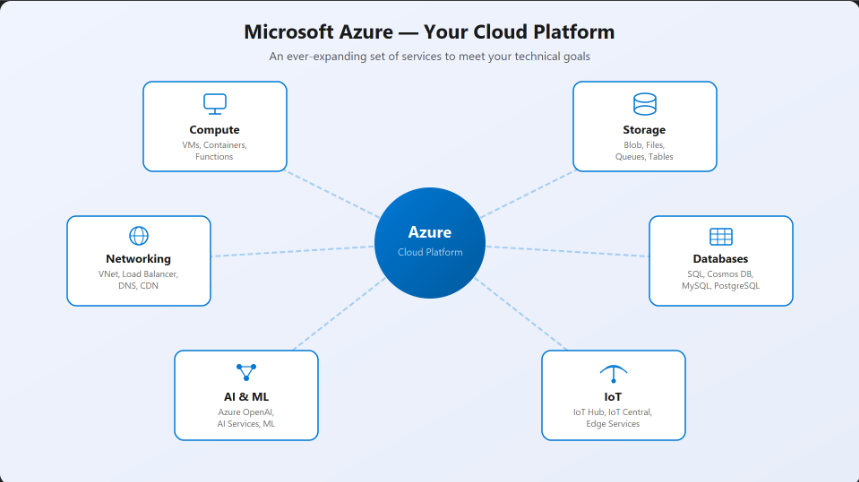

# Microsoft Azure

Microsoft Azure is a cloud computing platform and service offered by Microsoft. It provides a wide range of cloud services, including:

- Computing
- Storage
- Networking
- Databases
- Analytics
- Artificial Intelligence
- Internet of Things (IoT)

Organizations use Azure to build, deploy, and manage applications and services through Microsoft-managed data centers.

# Microsoft Azure Services

Microsoft Azure offers a broad range of cloud services that support various business and technical needs. Here are some of the main categories and examples of Azure services:

---

## 1. Compute
- **Azure Virtual Machines:** Run Windows or Linux VMs in the cloud.
- **Azure App Service:** Host web apps, REST APIs, and mobile backends.
- **Azure Functions:** Serverless compute for event-driven applications.
- **Azure Kubernetes Service (AKS):** Managed Kubernetes container orchestration.

## 2. Storage
- **Azure Blob Storage:** Store unstructured data like images and documents.
- **Azure Disk Storage:** Persistent, high-performance disk storage for VMs.
- **Azure File Storage:** Shared file storage accessible via SMB protocol.

## 3. Networking
- **Azure Virtual Network:** Create private networks in the cloud.
- **Azure Load Balancer:** Distribute incoming traffic across multiple resources.
- **Azure VPN Gateway:** Securely connect on-premises networks to Azure.

## 4. Databases
- **Azure SQL Database:** Managed relational database service.
- **Azure Cosmos DB:** Globally distributed NoSQL database.
- **Azure Database for MySQL/PostgreSQL:** Managed open-source database services.

## 5. Analytics
- **Azure Synapse Analytics:** Big data analytics and data warehousing.
- **Azure Data Lake Storage:** Scalable storage for big data analytics.
- **Azure Databricks:** Apache Spark-based analytics platform.

## 6. AI & Machine Learning
- **Azure Machine Learning:** Build, train, and deploy machine learning models.
- **Azure Cognitive Services:** Pre-built APIs for vision, speech, language, and decision-making.

## 7. Internet of Things (IoT)
- **Azure IoT Hub:** Central hub for managing IoT devices.
- **Azure IoT Central:** Simplified IoT app development and management.

## 8. Security & Identity
- **Azure Active Directory:** Identity and access management.
- **Azure Security Center:** Unified security management and threat protection.

## 9. DevOps
- **Azure DevOps Services:** Tools for CI/CD, project tracking, and collaboration.
- **Azure Pipelines:** Build and release automation.

## 10. Migration
- **Azure Migrate:** Tools and guidance for migrating workloads to Azure.

---
  
# Azure Global Infrastructure & Regions

## Azure Global Infrastructure
- **Azure global infrastructure** refers to the worldwide network of data centers, hardware, and resources that Microsoft Azure uses to deliver its cloud services.

- Ensures high availability, scalability, security, and compliance.
- Components:
  - **Data Centers:** Physical facilities with servers and networking.
  - **Regions:** Geographic groupings of data centers.
  - **Availability Zones:** Separate locations within a region for redundancy.
  - **Edge Locations:** For low-latency content delivery.

## Azure Regions
- An **Azure region** is a set of data centers deployed within a specific geographic area. Each region is isolated from others to ensure fault tolerance and disaster recovery.
- **Purpose:** Enables resource deployment close to users, supports compliance, and improves availability.
- **Examples:** East US, West Europe, Southeast Asia, Australia East, Central India.

## Why It Matters
- **Performance:** Lower latency for users.
- **Compliance:** Meets data residency requirements.
- **Resilience:** Supports disaster recovery and fault tolerance.
---
 

## Azure Physical Infrastructure – Key Points

- **Datacenters**: Large facilities with servers, power, cooling, and networking.
- **Regions**: Geographic areas with one or more datacenters, used to deploy resources.
- **Availability Zones**: Physically separate datacenters within a region, each with independent power, cooling, and networking for high resiliency.
  - Use zones to protect workloads from datacenter failures.
  - Three types of services:
    - **Zonal**: Pinned to a specific zone (e.g., VMs).
    - **Zone-redundant**: Auto-replicated across zones (e.g., SQL Database).
    - **Non-regional**: Always available, not tied to a region (e.g., Azure DNS).
- **Region Pairs**: Most regions are paired with another at least 300 miles away for disaster recovery and data residency.
  - If one region fails, the other can take over.
  - Updates and recovery are managed to minimize downtime.
- **Sovereign Regions**: Isolated Azure instances for compliance (e.g., US Gov, China).

**Example:**  
Deploy VMs across availability zones for high availability, and use region pairs for disaster recovery.

  
# Microsoft Entra ID (formerly Azure AD)

- **Cloud-based identity & access management (IAM) service by Microsoft**
- Manages users, groups, devices, and access to apps/resources (cloud & on-premises)
- **Key Features:**
  - Single Sign-On (SSO) for multiple apps
  - Multi-Factor Authentication (MFA)
  - Conditional Access policies
  - Identity Protection & Privileged Identity Management (PIM)
  - Self-service password reset & group management
  - B2B/B2C collaboration (external partners & customers)
- **Use Cases:**
  - Secure access to Microsoft 365, Azure, SaaS apps
  - Enable secure remote work
  - Protect against identity threats
  - Simplify user onboarding/offboarding
  - Meet compliance requirements
---

  
# Microsoft Azure Scope

**Azure scope** refers to the boundaries or levels at which Azure resources and access management are organized and applied. Scopes help define where policies, permissions, and resource management actions take effect.

## Main Azure Scope Levels

1. **Management Group**
   - Highest level; groups multiple subscriptions for unified policy and access management.

2. **Subscription**
   - Logical container for Azure resources; used for billing, resource organization, and access control.

3. **Resource Group**
   - A container within a subscription that holds related resources (VMs, storage, databases, etc.) for easier management.

4. **Resource**
   - The individual Azure service or item (e.g., a virtual machine, storage account, database).

## Why Scope Matters

- **Access Control:** Assign roles and permissions at different scopes (e.g., subscription, resource group).
- **Policy Application:** Apply Azure Policies or Blueprints at any scope level.
- **Organization:** Structure resources for management, billing, and compliance.
---

  
# Ways to Interact with Azure Portal

1. **Azure Portal (Web UI)**
   - Web-based graphical interface at [https://portal.azure.com](https://portal.azure.com)
   - Manage and monitor Azure resources visually.

2. **Azure CLI (Command-Line Interface)**
   - Cross-platform command-line tool (`az` command).
   - Automate and script resource management.

3. **Azure PowerShell**
   - PowerShell module for managing Azure resources.
   - Useful for automation and advanced scripting.

4. **Azure Mobile App**
   - Mobile application for iOS and Android.
   - Monitor and manage resources on the go.

5. **Azure REST APIs**
   - Programmatic access to Azure services via HTTP requests.
   - Integrate Azure management into custom applications.

6. **Azure SDKs**
   - Software Development Kits for languages like .NET, Java, Python, Node.js, etc.
   - Build and manage Azure resources programmatically.
---